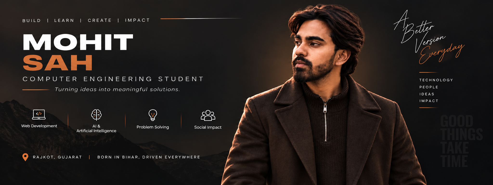

  

 

# Hi, I'm Mohit Sah 👋

### Engineering Student · Developer · Builder · AI Enthusiast

I build practical software products across **AI, automation, full-stack web development, and real-world business systems**. I like turning ideas into working products, connecting multiple technologies, and shipping things people can actually use.

  
  
  
  

---

## 🚀 What I Build

| Area | What I'm interested in |
|---|---|
| 🤖 **AI Systems** | Multi-model AI applications, LLM integrations, AI agents and intelligent workflows |
| ⚡ **Automation** | Autonomous research, discovery, productivity and developer workflows |
| 🌐 **Full-Stack** | Modern web applications, APIs, databases and responsive product experiences |
| 💼 **Business Software** | Practical tools for businesses, education, restaurants and everyday workflows |
| 🧪 **Experiments** | New AI APIs, developer tools, open-source projects and emerging technologies |

---

## ⭐ Featured Projects

<table>
<tr>
<td width="50%" valign="top">

### 🔎 Huntlyst
**Autonomous Company Discovery & Lead Intelligence**

A platform for discovering companies, researching prospects and structuring qualifying lead intelligence through an automated workflow.

**Focus:** AI agents · research automation · lead intelligence

[View repository →](https://github.com/mohitsah08/huntlyst)

</td>
<td width="50%" valign="top">

### 🤖 PriShi
**Multi-Model AI System**

An AI system that integrates multiple AI models into a unified platform, making it possible to work with different models and AI capabilities from a single application.

**Focus:** multi-model AI · LLM integration · AI orchestration · intelligent workflows

[View repository →](https://github.com/mohitsah08/PriShi)

</td>
</tr>
<tr>
<td width="50%" valign="top">

### 📒 Digital Khata
**Digital Ledger & Bookkeeping**

A digital bookkeeping system designed around practical business record-keeping and day-to-day ledger workflows.

**Focus:** business software · data management · product engineering

[View repository →](https://github.com/mohitsah08/DigitalKhata0.2)

</td>
<td width="50%" valign="top">

### 💍 WivaahVision
**Web Product**

A web product project focused on building a polished, responsive and production-oriented digital experience.

[View repository →](https://github.com/mohitsah08/wivaahvision)

</td>
</tr>
<tr>
<td width="50%" valign="top">

### 🏥 City Hospital
**Hospital Web Application**

A practical web project focused on presenting hospital information and building useful customer-facing workflows.

[View repository →](https://github.com/mohitsah08/City-Hospital)

</td>
<td width="50%" valign="top">

### 🍽️ Gupta Restaurant
**Restaurant Web Application**

A customer-facing restaurant web project with menu and location-oriented information.

[View repository →](https://github.com/mohitsah08/gupta-restaurant)

</td>
</tr>
</table>

---

## 🛠️ Technologies

  

---

## 📊 GitHub Activity

  
  

  

---

## 🧠 Currently Learning & Building

- 🤖 Multi-model AI systems and LLM-powered applications
- 🧩 AI agents and autonomous workflows
- 🌐 Full-stack product engineering
- 🔌 APIs, databases and backend architecture
- ☁️ Deployment, CI/CD and production workflows
- 🛠️ Developer tools that make software creation faster and easier

---

## 📌 Highlights

- 🚀 Building and experimenting with AI-powered products
- 🔎 Working on autonomous discovery and lead-intelligence workflows
- 📒 Building practical business software such as Digital Khata
- 🌐 Creating and deploying real-world web applications
- 🧪 Exploring multiple AI providers and model integrations
- 💻 Continuously learning by building rather than only following tutorials

---

## 🌍 Connect With Me

  <a href="https://x.com/mohitsah08">𝕏 @mohitsah08</a> ·
  <a href="https://www.instagram.com/mohitsah08">Instagram @mohitsah08</a> ·
  <a href="https://www.facebook.com/share/1To1g5xUuv/">Facebook</a>

---

**Build → Learn → Ship → Improve**

